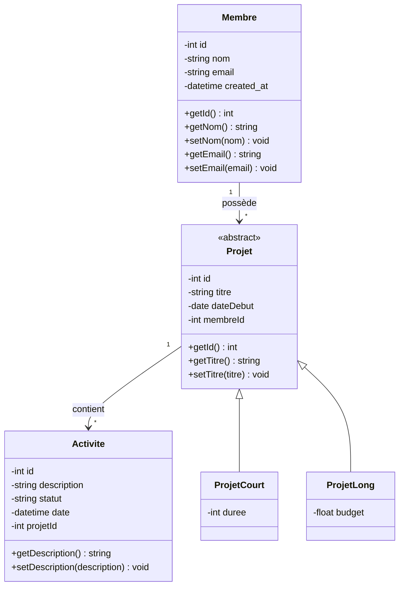

```mermaid
classDiagram
    class Membre {
        -int id
        -string nom
        -string email
        -datetime created_at
        +getId() int
        +getNom() string
        +setNom(nom) void
        +getEmail() string
        +setEmail(email) void
    }

    class Projet {
        <<abstract>>
        -int id
        -string titre
        -date dateDebut
        -int membreId
        +getId() int
        +getTitre() string
        +setTitre(titre) void
    }

    class ProjetCourt {
        -int duree
    }

    class ProjetLong {
        -float budget
    }

    class Activite {
        -int id
        -string description
        -string statut
        -datetime date
        -int projetId
        +getDescription() string
        +setDescription(description) void
    }

    Membre "1" --> "*" Projet : possède
    Projet "1" --> "*" Activite : contient

    Projet <|-- ProjetCourt
    Projet <|-- ProjetLong

```
